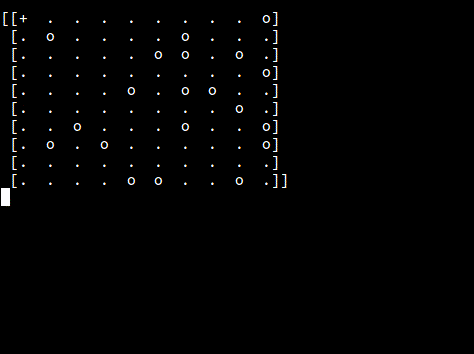
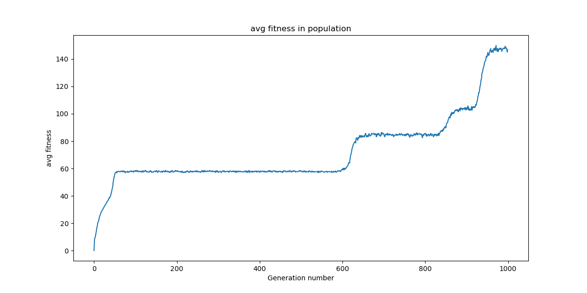
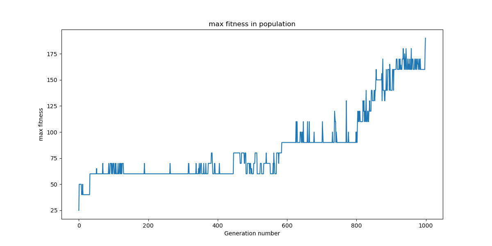

# Evolving Robby - Genetic Algorithm

Genetic algorithm for a simple rule-based robot on a 2D-grid.

## Overview

Genetic algorithm is a heuristic search that reflects the process of natural selection. Individuals with the best fitness score are chosen to generate the offspring. The aim of the selection process, crossovers and mutations is to obtain a higher fitness score in following generations.

In this project, the genetic algorithm has been used to find the best set of movement rules for a robot on a grid that collects cans.

You can find a sample behavior of a robot from 1000th generation below:



## Details
### Robby and his World

Robby is a very simple robot. He lives in a simulated world, consisting of a small (10x10) grid of squares. His life goal is to collect empty soda cans, which are distributed randomly in the world. Each square of the grid can contain zero or one empty soda can. Robby has very bad vision. He only sees the content of the square he stands in and the four side-adjacent cells (a square can be empty, be a wall, or contain an empty soda can). 
Based on the input from these 5 cells, in each simulation step, he can choose from one of the following actions:

- Move (x4 directions)
- Move randomly
- Stay put
- Try to pick up a can (may fail if there's none)

The simulation can continue for a fixed number of steps or until empty soda cans are collected.

Robby gets scores points based on his behavior during the simulation:
- Collecting an empty soda can: +10 pts
- Failing to pick a can (trying on an empty square): -1 pt
- Crashing into a wall (trying to move outside of the world grid): -5 pt

### Robby's genetic code

Robby makes his decision based on the rule table he's inheriting from his parents. The rule table consists of 243 entries corresponding to every possible combination of his inputs. Each entry defines an action that Robby will perform when confronted with the given input.

| North | South | East  | West  | Current | Action |
|-------|-------|-------|------ |---------|--------| 
| Empty | Empty | Empty | Empty | Empty   | Move R |
| Empty | Empty | Empty | Empty | Can     | Pick   |
| ...   | ...   | ...   | ...   | ...     | ...    |
| Wall  | Wall  | Wall  | Wall  | Empty   | Stay   |

The table makes up Robby's "genetic code", which he will pass onto his children.<br>
Note: some of those rules (inputs) are impossible in the Robby's world, but that's OK, even humans have garbage DNA.

### Simulation

Robots are evolved in generations of N (implementation-dependent) individuals. The first generation has random genetic codes. Each individual is put a number of times (K) in a separate world to demonstrate his abilities. These worlds should differ in can distribution so that each genetic code is tested in different conditions. An average score from all worlds becomes an individual's score. After each individual has been tested, a new generation is created.

### Reproduction

Every generation (except the first one) is created from the previous one by sampling two parents and producing a child until N children are created. For a robot, the probability of being chosen to be a parent should depend on its score (better score = higher probability). The child's genetic code is created by concatenating a prefix from one parent and a suffix from the other one, to create a complete rule table. Additionally, a small number of mutations are introduced.


## Results 

Sample results of the evolution efficiency are illustrated by the following charts of the average and maximal score of robots in each generation.


The evolution consists of periods of constant fitness (no progress in thousands of generations) and periods of substantial innovations represented by a rapid growth of fitness, similarly as in biological evolution. <br>
The average score rises shortly after the evolution starts. During the evolution process, the growths of the function reflect biological exaptations and intermingle with groups of constant, non-adaptive generations. This evolution ends with a peak of fitness reaching almost the highest possible value. 



## Build and Run

```
git clone git@github.com:NataeSz/evolving-robot.git
pip install -r ./src/requirements.txt
./src/main.py --generation-count 500  # Find best genotype within 500 generations
./src/track_movement.py  # Interactively show simulation
```
